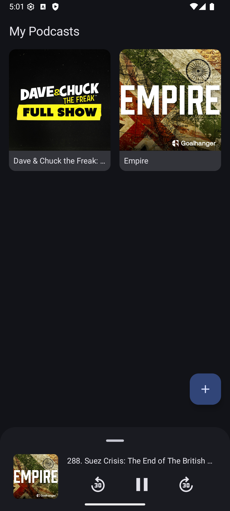
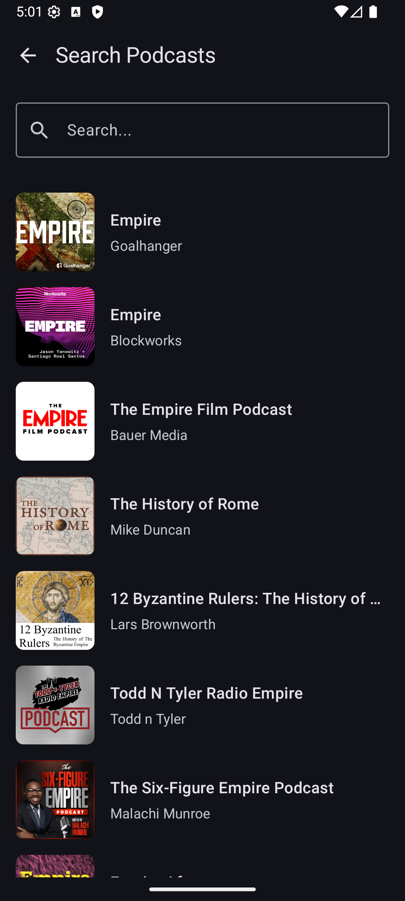
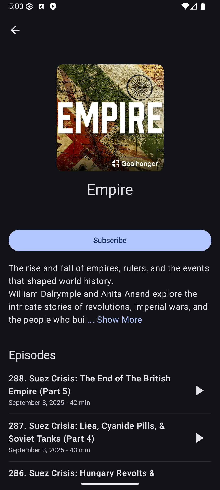
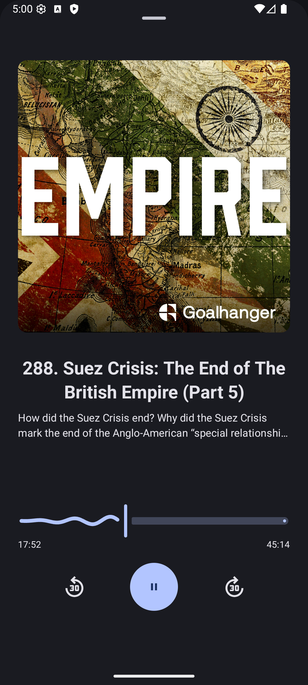

# Just Let Me Listen

A simple, clean, and lightweight FOSS podcast player for Android.

## Overview

Just Let Me Listen is a minimalist podcast streaming application that focuses on simplicity and usability. No fancy bells and whistles - just a clean, modern interface for discovering and listening to your favorite podcasts using iTunes Search API and RSS feeds.

## Screenshots

<p align="center">
  
  
  
  
</p>

## Features

- **Stream podcasts** directly from RSS feeds
- **Search podcasts** using iTunes Search API
- **Android Auto support** for in-car listening
- **Results caching** using Room database for faster loading
- **Media controls** with ExoPlayer integration
- **Background playback** with media service
- **Episode progress** and playback history

## Planned Features

The following features are in progress:

- [ ] **Better recently played support**
- [ ] **Audio download** for offline listening
- [ ] **Scheduled updates and notifications** for new episodes

## Tech Stack

- **Language**: Kotlin
- **UI Framework**: Jetpack Compose
- **Architecture**: MVVM with Repository pattern
- **Media Playback**: ExoPlayer (Media3)
- **Database**: Room (currently used for caching)
- **Networking**: Ktor
- **Dependency Injection**: Koin
- **RSS Parsing**: RSS Parser
- **Image Loading**: Coil

## Requirements

- Android 8.0 (API level 26) or higher
- Internet connection required for streaming (no offline support yet)

## Installation

### From Source

1. Clone the repository:

```bash
git clone https://github.com/yourusername/JustLetMeListen.git
cd JustLetMeListen
```

2. Open the project in Android Studio

3. Build and run the app:

```bash
./gradlew assembleDebug
```

## Current Limitations

- **Streaming only**: Audio content requires an active internet connection
- **No offline downloads**: Episodes cannot be downloaded for offline playback (planned feature)
- **No automatic updates**: No scheduled checking for new episodes or notifications (planned feature)

## Contributing

Contributions are welcome! Please feel free to submit a Pull Request. For major changes, please open an issue first to discuss what you would like to change.

### Priority Areas for Contribution

- Audio download functionality
- Scheduled episode updates and notifications
- UI/UX improvements
- Performance optimizations

## License

This project is licensed under the GNU General Public License v3.0 - see the [LICENSE](LICENSE) file for details.

## Support

If you encounter any issues or have feature requests, please open an issue on GitHub.

---

**Just Let Me Listen** - Simple podcast streaming, the way it should be.
